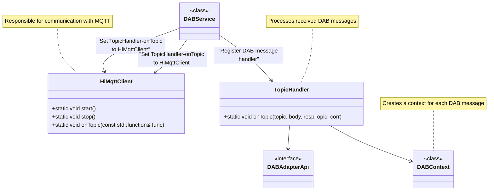
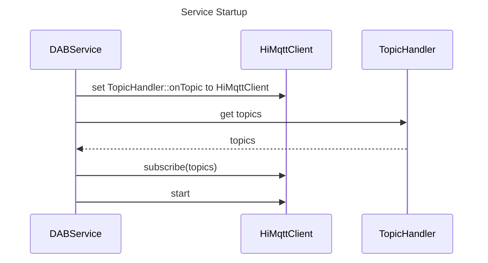
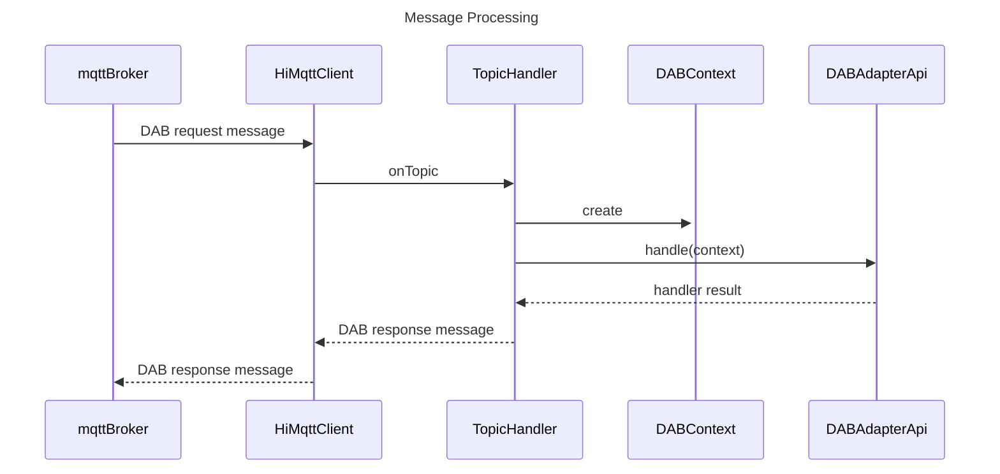

# Overview

This project is an implementation based on the **DAB (Device-Automation-Bus) standard**, developed using **C++**. DAB is a communication protocol specifically designed for testing living room devices, aiming to achieve automated control and data interaction between devices.

The main functionalities of the project include:
- Handling DAB message layer interfaces, parsing, and dispatching.
- Providing an adaptation layer for specific devices.

## Project Outputs
- **libdab.so**: A dynamic library for DAB message processing.
- **dab_demo**: A standalone DAB demonstration program.
- **ndlb (No DAB MQTT Left Behind)**: A unit testing program for testing DAB processing logic without relying on MQTT.

---

# Project Structure

The project is divided into the following modules:

| Module           | Description                                                                 | Interface Location               | Implementation Location           |
| ---------------- | --------------------------------------------------------------------------- | -------------------------------- | --------------------------------- |
| **MQTT Communication Module** | Responsible for receiving and sending MQTT messages                         | `include/hi_mqtt_client.h`       | `src/mqtt`                        |
| **Message Processing Module** | Handles DAB messages, receives MQTT messages, and calls adaptation layer interfaces, ensuring new messages are processed in separate threads to avoid multi-thread interference | `include/hi_topic_handler.h`     | `src/dab/handler`                 |
| **Message Context Module** | Encapsulates received DAB messages into processing contexts, implementing request parsing, state maintenance, and response handling, with each context running in a separate thread | `include/dab/context`            | `src/dab/context`                 |
| **Device Adaptation Module** | Abstracts DAB interfaces into C-like interfaces, implemented by specific devices, and can be considered a sub-module of the message processing module | `include/dab/api`                | `src/dab/adapter_api`             |
| **Service Module** | Integrates the MQTT communication module, message processing module, and DAB message context module to provide a service library | `include/dab_service.h`          | `src/service`                     |
| **Unit Testing Program** | Provides message processing tests without relying on MQTT                   |                                   | `test/ndlb`                       |
| **Demo Program** | An executable DAB processing demonstration program                          |                                   | `src/demo`                        |
| **Utility Library** | Provides general functions such as logging, JSON parsing, time handling, and Base64 conversion | `include/utils`, `include/jsoncpp` | `src/utils`                       |
| **Other Unit Tests** | Unit tests for each module, to be gradually improved                        |                                   | `src/utils/ut`, `src/handler/utils/ut` |

---

# Implementation

## Module Interactions

### Class Diagram



### Sequence Diagram

#### Service Startup



#### Message Processing



---

## Code Example

### Service Startup Code

```cpp
extern "C" int runDabService() {
    FUN_LOG();
    
    TopicHandler::init(DABProperties::max_handle_threads);
    DABHandler::init();
    
    // 1. Register MQTT handler
    HiMqttClient::onTopic(TopicHandler::onTopic);
    
    // 2. Register notification and request response functions
    DABContext::setPublishFunc(publish);

    // 3. Get topics and subscribe from MQTT
    vector<string> topics;
    DABHandler::getTopics(topics);
    HiMqttClient::subscribe(topics);

    // 4. Register topic handler
    map<string, function<void(DABContext&)>> handles;    
    DABHandler::getTopicHandles(handles);
    TopicHandler::registerHandler(handles);
    
    // 5. Start MQTT communication
    try {
        HiMqttClient::start(DABProperties::mqtt_ip.c_str(), 
                DABProperties::mqtt_port, 
                DABProperties::mqtt_user.c_str(), 
                DABProperties::mqtt_password.c_str(), 
                DABProperties::mqtt_client_id.c_str());
    } catch (const char* error) {
        DABLOG_ERROR("MqttClientRun failed: %s", error);
        HiMqttClient::stop();
        TopicHandler::destroy();
        return -1;
    }
    return 0;
}
```

---

## Testing

### DAB Message Testing

The test code is located in the `test/ndlb` directory, named **No DAB MQTT Left Behind**. This test program aims to eliminate reliance on MQTT and specific processes, reducing testing workload by 80%.

#### Test Entry: `ndlb_main.cpp`

```cpp
#include <gtest/gtest.h>
#include "utils/hi_log.h"
#include "dab/dab_handler.h"
#include "dab/dab_api.h"
#include "hi_topic_handler.h"
#include "app_attributies.h"

using namespace std;

namespace {	
    void publish(const char* topic, const char* body) {
        DABLOG_ALWAYS("topic: %s, body: %s", topic, body);
    }

    void dabInit() {
        FUN_LOG();
        DABProperties::device_id = "this_is_a_test";
        TopicHandler::init(5);
        DABHandler::init();				
        DABContext::setPublishFunc(publish);
        map<string, function<void(DABContext&)>> handles;    
        DABHandler::getTopicHandles(handles);
        TopicHandler::registerHandler(handles);
        dab_api_init();
    }

    void dabDestory() {
        FUN_LOG();
        TopicHandler::destroy();
        DABHandler::destroy();
        dab_api_destroy();
    }
}

int main(int argc, char** argv) {
    ::testing::InitGoogleTest(&argc, argv);    
    dabInit();
    int ret = RUN_ALL_TESTS();
    dabDestory();
    return ret;
}
```

#### Running Tests

After compilation, the `ndlb` executable is located in the `dab/build/out` directory. Run it directly:

```bash
./ndlb
```

---

### Other Unit Tests

Other unit tests are located near the source code of each module and are compiled using the original Makefile. For example, the `utils` module:

#### Compilation and Execution

```bash
cd dab/src/utils/ut
make
./test.out
```

---

# Compilation

## Dependency Installation

### Install `cjson` Library

Mosquitto depends on the `cjson` library, which must be installed beforehand. On Ubuntu, use the following command:

```bash
sudo apt-get install libcjson-dev
```

### Install `xsltproc` Tool

```bash
sudo apt-get install xsltproc
```

---

## Compile Mosquitto

1. Enter the `third_libs` directory, extract and compile Mosquitto:

```bash
cd dab/third_libs
tar -xvzf mosquitto-2.0.15.tar.gz
cd mosquitto-2.0.15
make
```

2. If encountering documentation generation issues, skip `doc` generation:

```bash
# Comment out the following code in Makefile
# docs :
#	set -e; for d in man; do $(MAKE) -C $${d}; done
```

3. Obtain Mosquitto library files and create symbolic links:

```bash
cd dab
mkdir libs
cp third_libs/mosquitto-2.0.15/lib/libmosquitto.so.1 libs
cd libs
ln -s libmosquitto.so.1 libmosquitto.so
```

---

## Compile DAB

1. Create a build directory and compile:

```bash
cd dab
mkdir build
cd build
cmake ..
make
```

2. The compiled files are located in the `dab/build/out` directory:

```bash
ls out/
dab_demo  libdab.so  ndlb
```